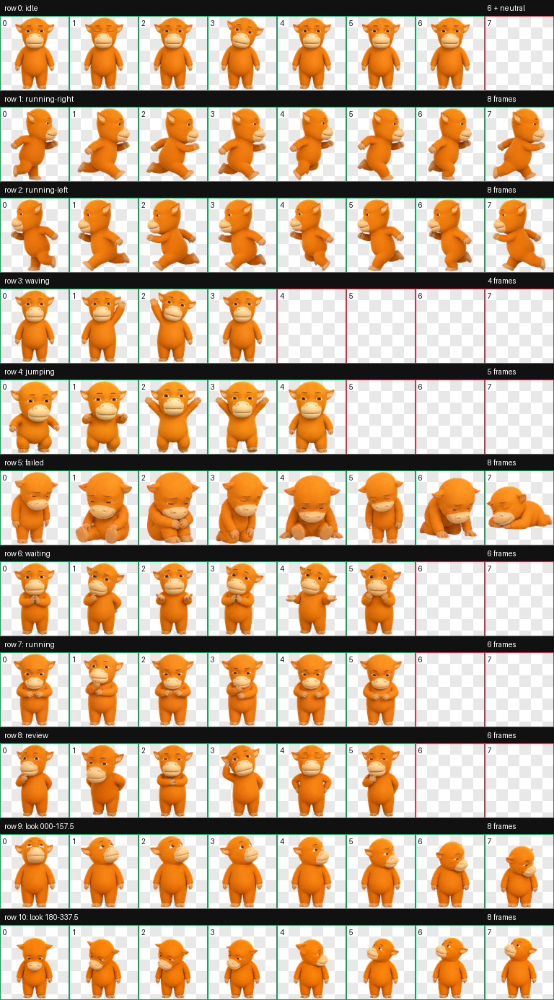
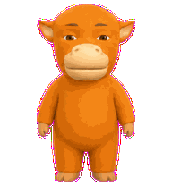
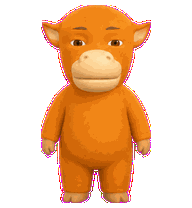
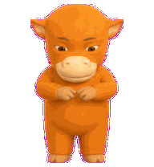
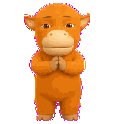
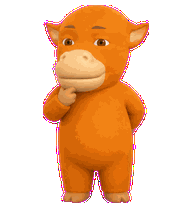

# Niulai Codex Pet

A custom Codex v2 animated pet inspired by a playful orange Chinese animated calf character. Niulai has a soft early-CG toy look, sleepy expressive eyes, a pale muzzle, tiny ears, and a gentle little-work-buddy personality.

## Preview



## Actions

| Action | Idle | Waving | Running | Waiting | Review |
| --- | --- | --- | --- | --- | --- |
| Preview |  |  |  |  |  |

## Files

- `pet.json` - Codex pet manifest.
- `spritesheet.webp` - v2 animated spritesheet, `1536x2288`.
- `contact-sheet-extended.png` - full QA contact sheet.
- `look-directions.png` - 16-direction gaze QA sheet.
- `previews/` - selected action GIF previews.

## Install

Copy this folder into your Codex pets directory:

```bash
mkdir -p ~/.codex/pets/niulai
cp pet.json spritesheet.webp ~/.codex/pets/niulai/
```

The manifest uses `spriteVersionNumber: 2`.

